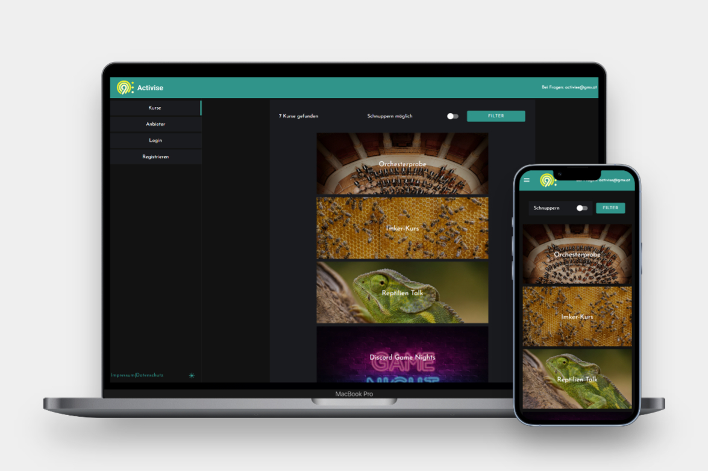
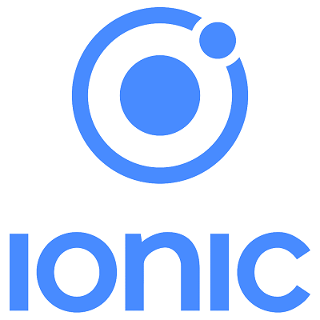
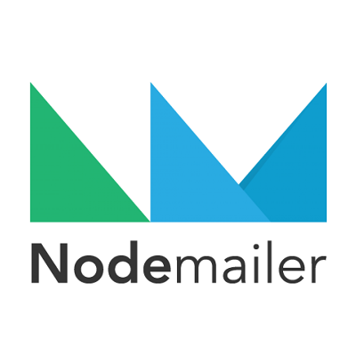
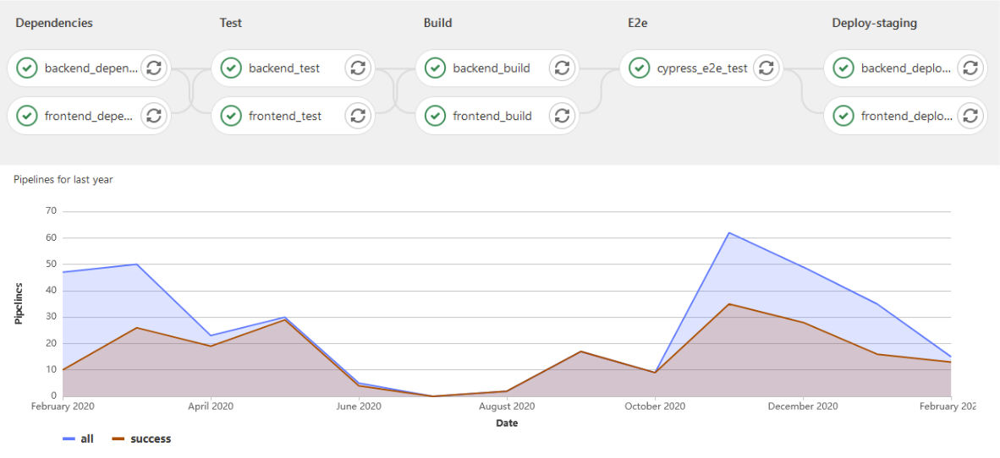
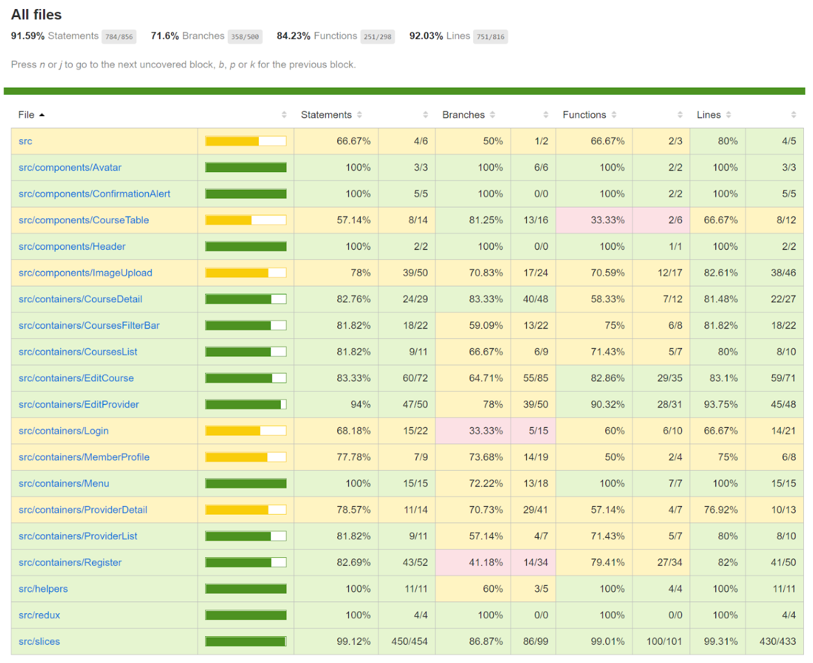
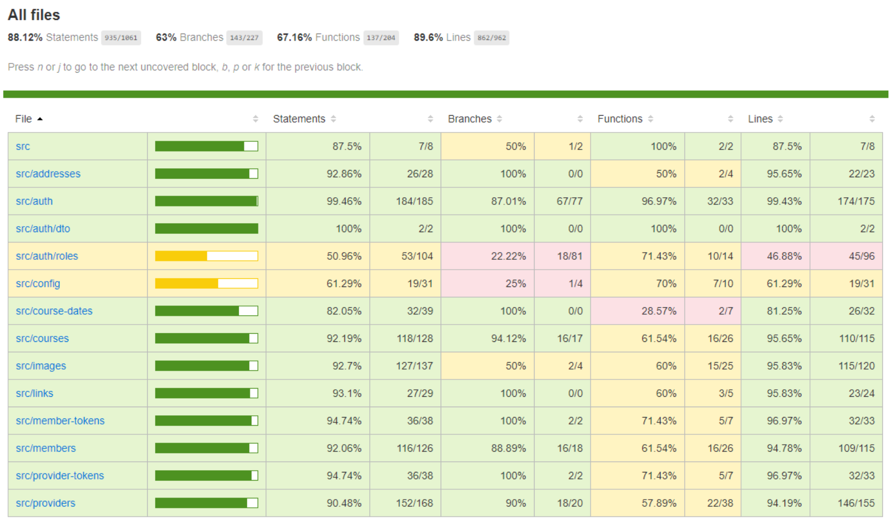

# [Activise](https://portfolio.fh-salzburg.ac.at/projects/2020-activise/)
## Like Google - just for activities

## Project Description

The repository contains the backend code for a web application called Activise, which was developed as the final project of the MultiMediaTechnology Master's degree programme (abbreviated as "mmp").
The development of the web app took place over a period of two years, from 2020 to 2022.

Activise is a platform designed to bring together individuals with similar interests. The web app provides a space for local leisure providers to manage their course offerings, enabling members to access all relevant information on course profiles, as well as an overview of upcoming courses and trial dates. With precise filters, users can easily navigate the wide range of courses available and find the ones that best suit their interests.

FH Salzburg - Portfolio: [https://portfolio.fh-salzburg.ac.at/projects/2020-activise](https://portfolio.fh-salzburg.ac.at/projects/2020-activise)

Staging environment: [https://activise-staging.multimediatechnology.at/courses](https://activise-staging.multimediatechnology.at/courses)  
Productive environment: [https://activise.multimediatechnology.at/courses](https://activise.multimediatechnology.at/courses)

Swagger Documentation: [https://activise.multimediatechnology.at/api/docs/](https://activise.multimediatechnology.at/api/docs/)

## Project Timeline

* 1st Semester - Ideation Phase
    - Team building phase
    - User Research and Needs Analysis
    - Rapid prototyping

* 2nd Semester - Development Phase
    - Hold regular team meetings to track progress and discuss issues
    - Conduct feedback and coaching sessions to improve performance and ensure alignment with project objectives

* 3rd Semester - Finalisation Phase
    - Finalise Minimum Viable Product (MVP)
    - Ensure compliance with code coverage requirements
    - Conduct multiple rounds of user testing and implement feedback through refactoring

* 4th Semester - Launch Phase
    - Release the prodcut
    - Conduct final presentation to showcase the project's features and accomplishments

## Project Contributors
Concept by Isabella Molterer, Lisa-Maria Eibl, Kevin Haunschmied and Julia Schmolmüller

Frontend Team: Kevin & Julia  
Backend Team: Isabella & Lisa-Maria

DevOps: Kevin
Project Lead: Isabella

## Project Requirements

The frontend was developed using the React framework, along with ionic UI components and the redux toolkit to manage state effectively.

The backend was developed using the Nestjs framework and implemented a RESTful API. 
Data was stored in a MySQL database. In addition Amazon Web Services (AWS) was leveraged for image storage.
Secure authentication was provided through JSON Web Tokens (JWT). Additionally, Nodemailer was integrated into the server to facilitate email communication.

For version control, GitLab was used, with a pipeline implemented to streamline testing, building, and deployment. 
inally, the University of Applied Sciences Salzburg provided a Git Runner and Hosting to support the development of the project.

### Frontend Technologies

<table>
  <tr>
    <td style="border:none;"></td>
    <td style="border:none;"></td>
    <td style="border:none;"></td>
    <td style="border:none;"></td>
    <td style="border:none;"></td>
    <td style="border:none;"></td>
  </tr>
 </table>

### Backend Technologies

<table>
  <tr>
    <td style="border:none;"></td>
    <td style="border:none;"></td>
    <td style="border:none;"></td>
    <td style="border:none;"></td>
  </tr>
  <tr>
    <td style="border:none;"></td>
    <td style="border:none;"></td>
    <td style="border:none;"></td>
    <td style="border:none;"></td>
  </tr>
 </table>

## DevOps Pipeline

## Test Coverage

<table>
    <tr>
        <th style="border:none;">Frontend Coverage</th>
        <th style="border:none;">Backend Coverage</th>
    </tr>
    <tr>
        <td style="border:none;"></td>
        <td style="border:none;"></td>
    </tr>
 </table>
